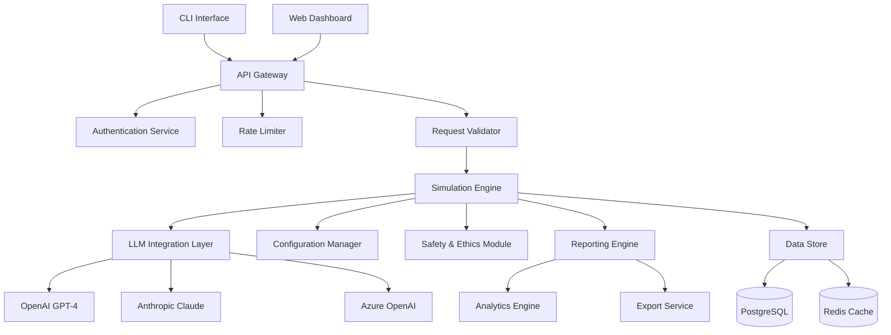

# ThreatGPT: Technical Architecture & Implementation Guide

## System Architecture Overview



## Core Components Design

### 1. CLI Interface (`src/threatgpt/cli/`)

**Purpose**: Primary user interface for threat simulation operations

**Key Files**:
- `main.py` - Entry point and argument parsing
- `commands/` - Individual CLI command implementations
- `validators.py` - Input validation and sanitization
- `formatters.py` - Output formatting and display

**Implementation Details**:
```python
# Example CLI structure
@click.group()
@click.option('--config', default='~/.threatgpt/config.yaml')
@click.option('--verbose', '-v', is_flag=True)
@click.pass_context
def cli(ctx, config, verbose):
    """ThreatGPT: AI-Powered Threat Simulation Platform"""
    ctx.ensure_object(dict)
    ctx.obj['config'] = load_config(config)
    ctx.obj['verbose'] = verbose

@cli.command()
@click.option('--scenario', required=True, help='Threat scenario configuration file')
@click.option('--target', help='Target profile specification')
@click.option('--output', '-o', help='Output format (json|yaml|report)')
def simulate(scenario, target, output):
    """Execute a threat simulation scenario"""
    # Implementation here
```

### 2. LLM Integration Layer (`src/threatgpt/llm/`)

**Purpose**: Abstraction layer for multiple LLM providers with unified interface

**Key Files**:
- `base.py` - Abstract base class for LLM providers
- `providers/` - Specific provider implementations
- `prompt_manager.py` - Prompt template management
- `response_parser.py` - Response processing and validation
- `cost_tracker.py` - Usage and cost monitoring

**Provider Architecture**:
```python
class BaseLLMProvider(ABC):
    @abstractmethod
    async def generate(self, prompt: str, **kwargs) -> LLMResponse:
        pass
    
    @abstractmethod
    def validate_config(self, config: dict) -> bool:
        pass
    
    @abstractmethod
    def estimate_cost(self, prompt: str) -> float:
        pass

class OpenAIProvider(BaseLLMProvider):
    def __init__(self, api_key: str, model: str = "gpt-4"):
        self.client = AsyncOpenAI(api_key=api_key)
        self.model = model
    
    async def generate(self, prompt: str, **kwargs) -> LLMResponse:
        # Implementation with retry logic, rate limiting
        pass
```

### 3. Configuration Engine (`src/threatgpt/config/`)

**Purpose**: YAML-based configuration management with validation

**Key Files**:
- `schema.py` - Pydantic models for configuration validation
- `loader.py` - Configuration loading and preprocessing
- `validator.py` - Schema validation and error reporting
- `templates/` - Built-in configuration templates

**Schema Design**:
```python
class ThreatScenario(BaseModel):
    metadata: ScenarioMetadata
    threat_type: ThreatType
    delivery_vector: DeliveryVector
    target_profile: TargetProfile
    behavioral_pattern: BehavioralPattern
    simulation_parameters: SimulationParameters
    
    class Config:
        extra = "forbid"  # Strict validation

class ThreatType(str, Enum):
    PHISHING = "phishing"
    MALWARE = "malware"
    SOCIAL_ENGINEERING = "social_engineering"
    INSIDER_THREAT = "insider_threat"
    APT = "advanced_persistent_threat"
```

### 4. Safety & Ethics Module (`src/threatgpt/safety/`)

**Purpose**: Ensure ethical use and prevent harmful content generation

**Key Files**:
- `content_filter.py` - Real-time content analysis
- `policy_engine.py` - Policy enforcement and validation
- `compliance_checker.py` - Regulatory compliance verification
- `audit_logger.py` - Comprehensive audit trail

**Safety Implementation**:
```python
class SafetyManager:
    def __init__(self):
        self.content_filter = ContentFilter()
        self.policy_engine = PolicyEngine()
        self.compliance_checker = ComplianceChecker()
    
    async def validate_request(self, request: SimulationRequest) -> SafetyResult:
        # Multi-layer safety validation
        content_check = await self.content_filter.analyze(request.content)
        policy_check = self.policy_engine.validate(request.metadata)
        compliance_check = self.compliance_checker.verify(request)
        
        return SafetyResult(
            approved=all([content_check.safe, policy_check.valid, compliance_check.compliant]),
            issues=[...],
            recommendations=[...]
        )
```

### 5. Simulation Engine (`src/threatgpt/core/`)

**Purpose**: Core orchestration of threat simulation workflows

**Key Files**:
- `simulator.py` - Main simulation orchestration
- `scenario_builder.py` - Dynamic scenario construction
- `context_manager.py` - Simulation context and state management
- `escalation_engine.py` - Dynamic threat escalation logic

**Simulation Workflow**:
```python
class ThreatSimulator:
    def __init__(self, llm_provider: BaseLLMProvider, config: ThreatConfig):
        self.llm_provider = llm_provider
        self.config = config
        self.safety_manager = SafetyManager()
        self.context_manager = ContextManager()
    
    async def execute_simulation(self, scenario: ThreatScenario) -> SimulationResult:
        # 1. Safety validation
        safety_result = await self.safety_manager.validate_request(scenario)
        if not safety_result.approved:
            raise SafetyViolationError(safety_result.issues)
        
        # 2. Context preparation
        context = self.context_manager.prepare_context(scenario)
        
        # 3. Multi-stage simulation execution
        stages = self.build_simulation_stages(scenario)
        results = []
        
        for stage in stages:
            stage_result = await self.execute_stage(stage, context)
            results.append(stage_result)
            context.update(stage_result)
        
        return SimulationResult(stages=results, metadata=context.metadata)
```

## Database Schema Design

### PostgreSQL Tables

```sql
-- Simulations table
CREATE TABLE simulations (
    id UUID PRIMARY KEY DEFAULT gen_random_uuid(),
    user_id VARCHAR(255) NOT NULL,
    scenario_config JSONB NOT NULL,
    status VARCHAR(50) NOT NULL,
    created_at TIMESTAMP WITH TIME ZONE DEFAULT NOW(),
    updated_at TIMESTAMP WITH TIME ZONE DEFAULT NOW(),
    completed_at TIMESTAMP WITH TIME ZONE,
    metadata JSONB
);

-- Simulation results table
CREATE TABLE simulation_results (
    id UUID PRIMARY KEY DEFAULT gen_random_uuid(),
    simulation_id UUID REFERENCES simulations(id),
    stage_number INTEGER NOT NULL,
    stage_type VARCHAR(100) NOT NULL,
    prompt_text TEXT NOT NULL,
    generated_content TEXT NOT NULL,
    safety_score DECIMAL(3,2),
    quality_score DECIMAL(3,2),
    created_at TIMESTAMP WITH TIME ZONE DEFAULT NOW(),
    metadata JSONB
);

-- Audit logs table
CREATE TABLE audit_logs (
    id UUID PRIMARY KEY DEFAULT gen_random_uuid(),
    user_id VARCHAR(255) NOT NULL,
    action VARCHAR(100) NOT NULL,
    resource_type VARCHAR(100) NOT NULL,
    resource_id VARCHAR(255),
    details JSONB,
    ip_address INET,
    user_agent TEXT,
    created_at TIMESTAMP WITH TIME ZONE DEFAULT NOW()
);

-- Usage tracking table
CREATE TABLE usage_tracking (
    id UUID PRIMARY KEY DEFAULT gen_random_uuid(),
    user_id VARCHAR(255) NOT NULL,
    provider VARCHAR(50) NOT NULL,
    model VARCHAR(100) NOT NULL,
    tokens_used INTEGER NOT NULL,
    cost_usd DECIMAL(10,4),
    created_at TIMESTAMP WITH TIME ZONE DEFAULT NOW()
);
```

### Redis Cache Structure

```python
# Cache key patterns
CACHE_PATTERNS = {
    'user_session': 'session:{user_id}',
    'rate_limit': 'rate_limit:{user_id}:{endpoint}',
    'prompt_cache': 'prompt:{hash}',
    'config_cache': 'config:{scenario_id}',
    'safety_cache': 'safety:{content_hash}'
}

# Example caching implementation
class CacheManager:
    def __init__(self, redis_client):
        self.redis = redis_client
    
    async def cache_prompt_response(self, prompt_hash: str, response: str, ttl: int = 3600):
        await self.redis.setex(
            f"prompt:{prompt_hash}", 
            ttl, 
            json.dumps(response)
        )
    
    async def get_cached_response(self, prompt_hash: str) -> Optional[str]:
        cached = await self.redis.get(f"prompt:{prompt_hash}")
        return json.loads(cached) if cached else None
```

## API Design Specification

### RESTful API Endpoints

```python
# FastAPI application structure
from fastapi import FastAPI, Depends, HTTPException, Security
from fastapi.security import HTTPBearer, HTTPAuthorizationCredentials

app = FastAPI(
    title="ThreatGPT API",
    description="AI-Powered Threat Simulation Platform",
    version="1.0.0"
)

# Authentication
security = HTTPBearer()

@app.post("/api/v1/simulations", response_model=SimulationResponse)
async def create_simulation(
    request: SimulationRequest,
    credentials: HTTPAuthorizationCredentials = Security(security)
):
    """Create and execute a new threat simulation"""
    # Implementation here
    pass

@app.get("/api/v1/simulations/{simulation_id}")
async def get_simulation(simulation_id: str):
    """Retrieve simulation results and status"""
    pass

@app.get("/api/v1/templates")
async def list_templates():
    """List available threat scenario templates"""
    pass

@app.post("/api/v1/validate")
async def validate_configuration(config: dict):
    """Validate a threat scenario configuration"""
    pass
```

## Deployment Architecture

### Docker Configuration

```dockerfile
# Multi-stage Dockerfile
FROM python:3.11-slim as builder

WORKDIR /app
COPY pyproject.toml poetry.lock ./
RUN pip install poetry && \
    poetry config virtualenvs.create false && \
    poetry install --only=main --no-dev

FROM python:3.11-slim as runtime

RUN groupadd -r threatgpt && useradd -r -g threatgpt threatgpt
WORKDIR /app

COPY --from=builder /usr/local/lib/python3.11/site-packages /usr/local/lib/python3.11/site-packages
COPY --from=builder /usr/local/bin /usr/local/bin
COPY src/ ./src/
COPY docker/entrypoint.sh ./

RUN chmod +x entrypoint.sh && \
    chown -R threatgpt:threatgpt /app

USER threatgpt
EXPOSE 8000

ENTRYPOINT ["./entrypoint.sh"]
CMD ["uvicorn", "src.threatgpt.api.main:app", "--host", "0.0.0.0", "--port", "8000"]
```

### Kubernetes Deployment

```yaml
apiVersion: apps/v1
kind: Deployment
metadata:
  name: threatgpt-api
spec:
  replicas: 3
  selector:
    matchLabels:
      app: threatgpt-api
  template:
    metadata:
      labels:
        app: threatgpt-api
    spec:
      containers:
      - name: threatgpt-api
        image: threatgpt:latest
        ports:
        - containerPort: 8000
        env:
        - name: DATABASE_URL
          valueFrom:
            secretKeyRef:
              name: threatgpt-secrets
              key: database-url
        - name: REDIS_URL
          valueFrom:
            secretKeyRef:
              name: threatgpt-secrets
              key: redis-url
        resources:
          requests:
            memory: "512Mi"
            cpu: "250m"
          limits:
            memory: "1Gi"
            cpu: "500m"
        livenessProbe:
          httpGet:
            path: /health
            port: 8000
          initialDelaySeconds: 30
          periodSeconds: 10
        readinessProbe:
          httpGet:
            path: /ready
            port: 8000
          initialDelaySeconds: 5
          periodSeconds: 5
```

## Monitoring & Observability

### Prometheus Metrics

```python
from prometheus_client import Counter, Histogram, Gauge, generate_latest

# Custom metrics
SIMULATION_COUNTER = Counter('threatgpt_simulations_total', 'Total simulations executed', ['status', 'threat_type'])
SIMULATION_DURATION = Histogram('threatgpt_simulation_duration_seconds', 'Simulation execution time')
ACTIVE_SIMULATIONS = Gauge('threatgpt_active_simulations', 'Currently running simulations')
LLM_API_CALLS = Counter('threatgpt_llm_api_calls_total', 'LLM API calls', ['provider', 'model'])

class MetricsManager:
    @staticmethod
    def record_simulation_start(threat_type: str):
        ACTIVE_SIMULATIONS.inc()
        SIMULATION_COUNTER.labels(status='started', threat_type=threat_type).inc()
    
    @staticmethod
    def record_simulation_complete(threat_type: str, duration: float):
        ACTIVE_SIMULATIONS.dec()
        SIMULATION_COUNTER.labels(status='completed', threat_type=threat_type).inc()
        SIMULATION_DURATION.observe(duration)
```

### Structured Logging

```python
import structlog
import logging

# Configure structured logging
structlog.configure(
    processors=[
        structlog.stdlib.filter_by_level,
        structlog.stdlib.add_logger_name,
        structlog.stdlib.add_log_level,
        structlog.stdlib.PositionalArgumentsFormatter(),
        structlog.processors.TimeStamper(fmt="iso"),
        structlog.processors.StackInfoRenderer(),
        structlog.processors.format_exc_info,
        structlog.processors.UnicodeDecoder(),
        structlog.processors.JSONRenderer()
    ],
    context_class=dict,
    logger_factory=structlog.stdlib.LoggerFactory(),
    wrapper_class=structlog.stdlib.BoundLogger,
    cache_logger_on_first_use=True,
)

logger = structlog.get_logger()

# Usage example
logger.info(
    "simulation_started",
    simulation_id=simulation_id,
    user_id=user_id,
    threat_type=scenario.threat_type,
    target_profile=scenario.target_profile.type
)
```

This technical architecture provides a comprehensive foundation for implementing ThreatGPT as a production-ready system with scalability, security, and maintainability in mind.